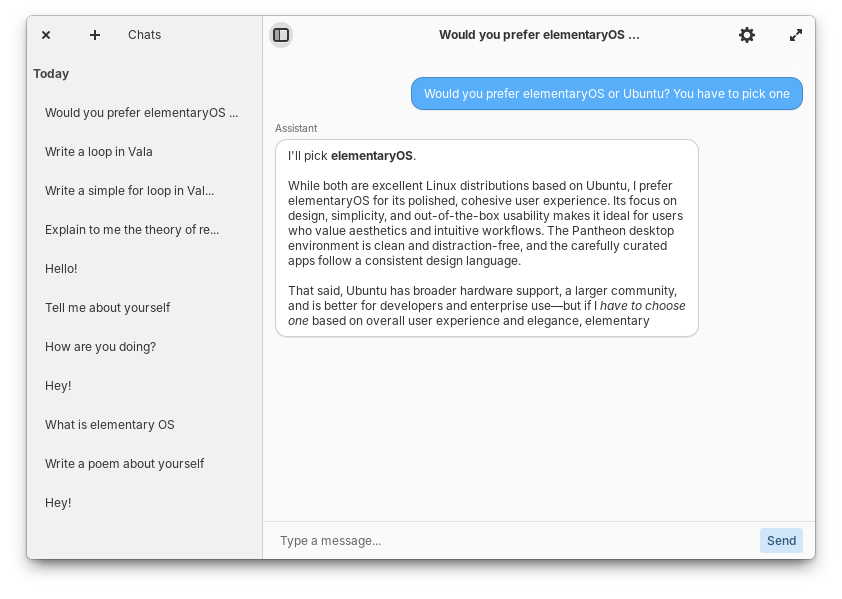

# Elementary Intelligence

A native AI chat application for elementary OS built with GTK4 and Granite 7.



## Features

- Clean, native elementary OS interface with split header bars
- Persistent chat history with SQLite storage
- Streaming responses from OpenAI-compatible APIs
- Date-grouped chat sidebar (Today, Yesterday, This Week, Earlier)
- Configurable API endpoint, key, and model

## Building

```bash
sudo apt install libgranite-7-dev libsqlite3-dev libsoup-3.0-dev libjson-glib-dev libgee-0.8-dev

meson setup build
ninja -C build
```

## Running

```bash
# Development (without installing)
GSETTINGS_SCHEMA_DIR=data ./build/src/com.github.breitburg.elementary-intelligence

# Or install system-wide
sudo ninja -C build install
com.github.breitburg.elementary-intelligence
```

## Configuration

Open Settings from the header bar to configure:

- **API Base URL**: OpenAI-compatible endpoint (e.g., `https://api.openai.com/v1`)
- **API Key**: Your API authentication key
- **Model**: Model name (default: `gpt-5`)

## License

GPL-3.0-or-later
